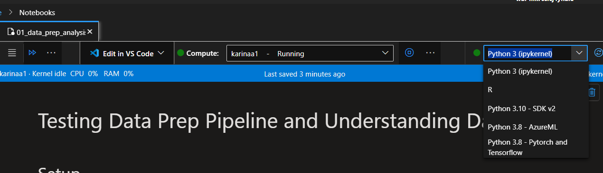
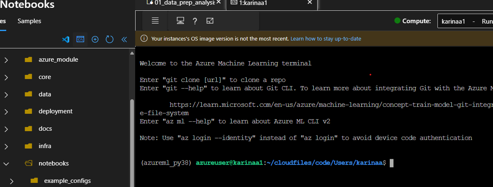
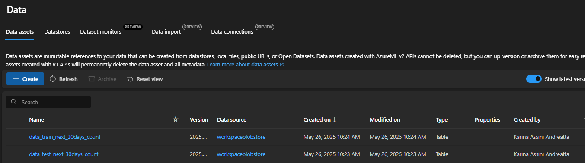

#   Advanced Machine Learning Forecasting for Call Center Operations 📞

## 🚀 3. Context 

This section establishes the context for the forecasting solution, outlining the background, objectives, and operational strategy behind the call center forecasting initiative. Here, we focus on aligning the data pipeline, feature engineering, and model deployment to predict future call volumes accurately.

Key Points:
- Business Objective: Enhance call volume predictions for better workforce management.
- Technical Strategy: Use automated data preprocessing and advanced machine learning techniques.
- Operational Impact: Streamline forecasting processes to improve staffing decisions and customer satisfaction.

In today’s fast-paced service environment, forecasting for call centers is crucial. Leveraging a machine learning model allows the application to predict call volumes months in advance. This capability supports better workforce planning by informing decisions on timely hiring and staff reallocation, ensuring that enough personnel are available during peak periods. Moreover, early predictions enable the organization to optimize resources, prepare targeted training sessions, and implement proactive strategies, ultimately enhancing customer satisfaction and operational efficiency.


## 🔧 1. Prerequisites

+ [azd](https://learn.microsoft.com/azure/developer/azure-developer-cli/install-azd), used to deploy all Azure resources and assets used in this sample.

+ [azure functions core tools](https://learn.microsoft.com/en-us/azure/azure-functions/functions-run-local?tabs=windows%2Cisolated-process%2Cnode-v4%2Cpython-v2%2Chttp-trigger%2Ccontainer-apps&pivots=programming-language-csharp)

+ [PowerShell Core pwsh](https://github.com/PowerShell/powershell/releases) if using Windows

+ [Python 3.11](https://www.python.org/downloads/release/python-3110/)

## 🔧 2. Infrastructure Creation

This sample uses [`azd`](https://learn.microsoft.com/azure/developer/azure-developer-cli/) and a bicep template to deploy all Azure resources:

1. Login to your Azure account: `azd auth login`

2. Create an environment: `azd env new`

3. Place documents for testing inside [data](./data/) folder 

4. Run `azd up`.

   + Choose your Azure subscription.
   + Enter a region for the resources.

   The deployment creates multiple Azure resources and runs multiple jobs. It takes several minutes to complete. The deployment is complete when you get a command line notification stating "SUCCESS: Your up workflow to provision and deploy to Azure completed."

## 📦 Installation

1. **Set up Your Environment**  
   If you're using Azure, select your environment as shown in the image below:  
   

2. **Clone the Repository**  
   Run the following commands in your terminal:
   ```bash
   git clone https://github.com/your-org/gbbai-o1-reasoning-over-ml.git
   cd gbbai-o1-reasoning-over-ml
   ```

3. **(Optional) Create and Activate a Python Virtual Environment**  
   If you're not in Azure (or prefer to work locally), create a virtual environment and activate it:
   ```bash
   python3 -m venv venv
   source venv/bin/activate or venv/Scripts
   ```

4. **Install Dependencies**  
   Install the required packages using:
   ```bash
   pip install -r requirements.txt
   ```

*This process can be executed via the terminal in your AML Studio or through VSCode connected to your VM compute.*



## Environment Variables Setup

To ensure proper execution of the project, append the following code to set up key environment variables. These variables are essential for connecting with your Azure resources:

```python
subscription=
resource_group=
workspace=
datastore_name = 
path_on_datastore = 
storage_account_name = 

```

Make sure to define these variables in your local environment or include them in your configuration settings before running the application.


## Use of the Notebooks 🚀

This section guides you through the interactive notebooks provided in this project. These notebooks are designed to help you prepare your data, analyze trends, and deploy your forecasting model with ease.

1. **Data Preparation & Analysis (01-data-prep-analysis-detailed.ipynb)**
   - Load and clean your raw call center data.
   - Aggregate daily features and compute the target variable.
   - Visualize trends, seasonality, and data distributions.

2. **Model Deployment & Evaluation (03-deploy-automl-forecasting-call-center-mlflow.ipynb)**
   - Deploy the best performing machine learning model.
   - Retrieve and evaluate forecasted call volumes.
   - Compare predictions with historical data for insightful analysis.

Enjoy the process and happy forecasting! 😊

Two notebooks streamline your forecasting workflow:

### Data Preparation & Analysis (01-data-prep-analysis-detailed.ipynb)
- Load raw CSV data via MLTable for tracking and versioning.
- Clean data: convert types, remove duplicates, and drop unnecessary columns.
- Feature engineer: compute time_to_resolve, daily call counts, holiday flags, and a 30-day rolling target.
- Explore: visualize trends, seasonality, and distributions.
- Save processed data as MLTable assets ("silver" layer) for later use.

### Model Deployment & Evaluation (03-deploy-automl-forecasting-call-center-mlflow.ipynb)
- Connect to your Azure ML Workspace and MLFlow.
- Retrieve the best AutoML run and its metrics.
- Download, register, and deploy the model using a batch endpoint.
- Forecast: compare predictions with historical data through visual analysis.


## Data 

## Data Visualization

Below is an overview of the call center data, illustrating the raw data input and its transformation via the pipeline:


i have a dataframe which contains data from a call center. Each row represents the opening call opened by a customer, i want to predict the volume of calls next month, how can i adjust this data to be able to do this

⚠️ Attention: In data_call_center.csv, the "raw" data is a MOCK dataset provided solely for demonstration purposes and to run our presented pipelines. Please adjust your data pipeline accordingly before applying it to real call center data.

### Use the data pipeline

The idea behind this pipeline is to automate all the data preparation steps required for your forecasting model. Instead of cleaning, aggregating, and feature-engineering your raw call center data manually every time, you define the transformations once and execute them with a scikit-learn pipeline.

1. Configure the Pipeline:  
   Create a configuration instance (FeatureEngineeringConfig) that specifies which data-preparation steps should run. These can include:
   - Dropping unnecessary columns.
   - Processing closure reasons by grouping similar entries.
   - Aggregating features on a daily basis.
   - Computing the target variable ("target_next_30days") by summing call counts over the next 30 days.
   - Adding additional features like holiday flags.  
   
   The DataPrepPipelineBuilder uses this configuration to construct a scikit-learn Pipeline populated with all the specified transformation steps.

2. Use the Pipeline:  
   Once built, you can apply the pipeline to your dataset by calling its fit and transform methods. For example, if your raw data is stored in a CSV file, you might instantiate a DataVolumePreparation transformer with the CSV path. This transformer will:
   - Load and clean the raw data (e.g., converting dates, filling missing values, calculating time-to-resolve).
   - Process and standardize closure reasons.
   - Aggregate the data by day and compute daily call counts.
   - Generate the target variable needed for forecasting.
   - Incorporate additional features such as holiday indicators.
   
   As a result, every time you run this pipeline, you receive a preprocessed DataFrame that is consistently formatted and ready for training your forecasting model. This approach streamlines repetitive tasks and reduces the potential for manual errors, especially when dealing with large or complex datasets.

